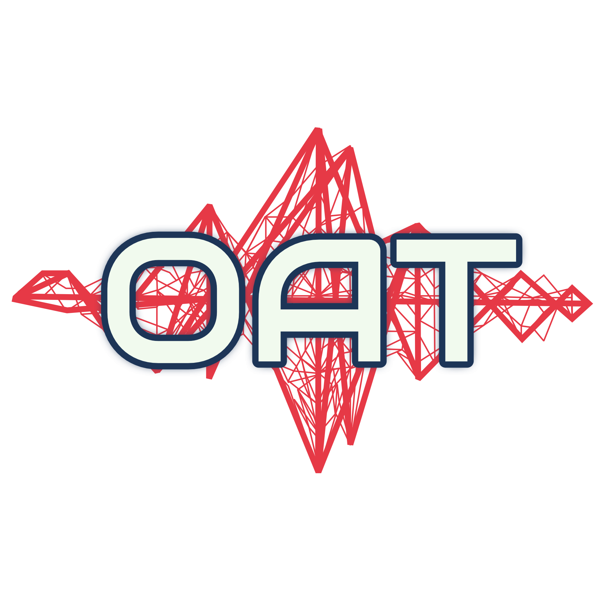

  

# Open Audio Tools

Open Audio Tools is an open-source hardware and software platform for music, hardware, and software creators around the world. Designed to be easily produced and self-built.

  

    

      <h3>SynTee</h3>
      
Standalone virtual sound module and synthesizer — built around the Teensy platform with multi-voice polyphony, real-time effects, and full MIDI control

      <a class="carousel-btn" href="https://github.com/openaudiotools/syntee">View on GitHub →</a>
    

    

      <h3>MixTee</h3>
      
Digital audio mixer, recorder, and USB audio interface — 16 inputs, 8 outputs, designed to be driven by MIDI controllers with all channels available over Ethernet

      <a class="carousel-btn" href="https://github.com/openaudiotools/mixtee">View on GitHub →</a>
    

    

      <h3>DESPEE</h3>
      
ESP32-S3 display board with touch LCD and rotary encoders — offloads the user interface from the audio controller so each device stays focused on its core task

      <a class="carousel-btn" href="https://github.com/openaudiotools/despee">View on GitHub →</a>
    

  

## The "WHY"

OpenAudioTools is an open-source hardware and software platform for building music tools that are simple, robust, and truly open — free for anyone to build, manufacture, and extend. Born out of need for robust, non experimental and open diy gear. Focused devices, one job done well, built on open standards, designed to work with the controllers you already own. [read more...](rationale.md)

## Core Principles

The project is built on three pillars:

### Open Hardware

- Easy to source components
- Affordable
- Only the essentials
- Easy to modify

### Open Software

- Simple
- Modular
- Extendable

### Open Connectivity

- Open, non-proprietary formats
- Fewer cables
- No proprietary connectors

## Hardware

Hardware should be **open**, **essential**, **standardized**, and **modular**.

### Open

All designs allow for easy modifications and adaptations.

### Essential

Each device focuses on one function and does it well. No frills, reasonable cost.

### Standardized

- **Teensy** microcontrollers for a consistent development environment
- **USB** for power (unified power adapters)
- **TRS 1/8" Type A** for MIDI
- **Ethernet** for system integration
- **USB-A MIDI Host** when possible
- **[DESPEE](https://github.com/openaudiotools/despee)** display module for touchscreen UI

### Modular

A motherboard approach:

- Often-used components (keys, encoders) are placed on standardized breakout boards for reuse across devices.
- Specific-purpose functionality (mic preamps, effects) is added as separate, interchangeable devices compatible with other gear.

## Firmware

- **Open** — Easy to extend, modify, and adapt
- **Essential** — Provides the main function very well
- **Standardized** — Teensy provides a unified architecture and common language

## Connectivity

Only open, non-proprietary standards. The essential signals are **audio** and **MIDI**, carried over cables only.

### Ethernet ([details](networking.md))

MIDI and audio are intended to be available over Ethernet:

- Single cable for audio and MIDI
- Low latency
- Cheap hubs and switches
- Easy internet connectivity
- Most boards already include Ethernet support

## Devices

### [SynTee](https://github.com/openaudiotools/syntee)

A standalone sound module with basic controls.

### [MixTee](https://github.com/openaudiotools/mixtee)

A digital audio mixer, recorder, and interface. Designed to be used with MIDI controllers. No built-in preamps.

- 16 inputs, 8 outputs (4 stereo)
- All channels available over Ethernet

### [HubTee](devices/hubtee.md)

A USB / MIDI / Ethernet hub with clock.

### [Voicee](devices/voicee.md)

A small mic preamp module that connects to MixTee or SynTee inputs.

### [Stringee](devices/stringee.md)

A small guitar/instrument preamp module that connects to MixTee or SynTee inputs.

## Ecosystem

See [Ecosystem Notes](ecosystem-notes.md) for a full catalog of the open-source hardware, firmware, and software used across the project.

