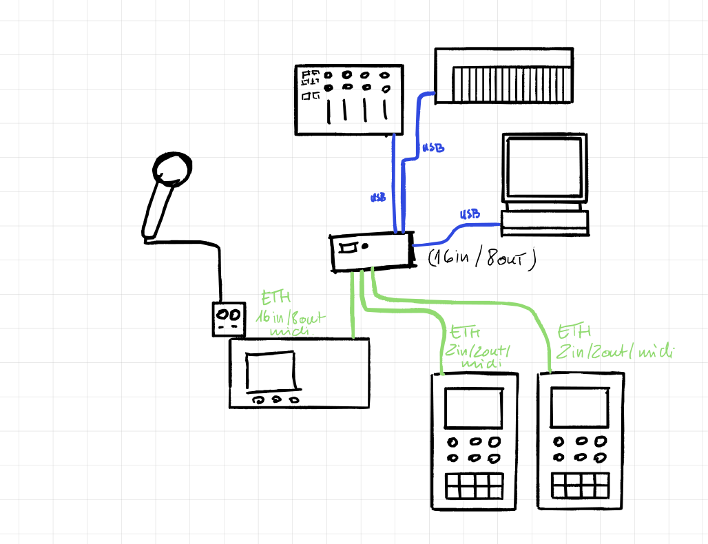
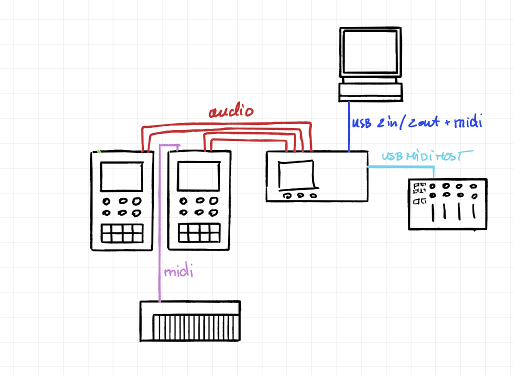
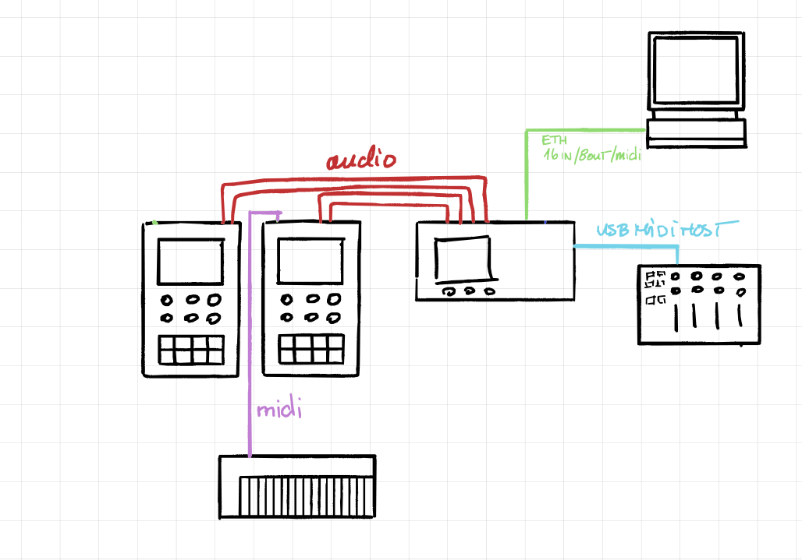
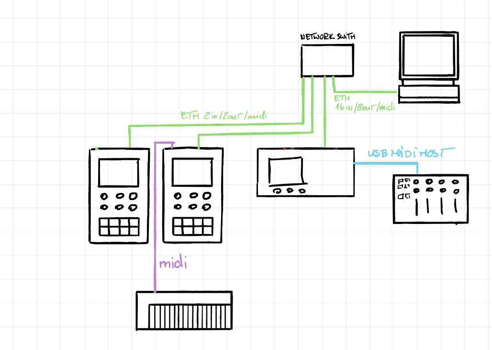

# OpenAudioTools Networking

How OpenAudioTools devices find each other, share audio, and exchange MIDI over a standard Ethernet network.

---

## Design goals

- **One cable** carries audio, MIDI, and control between devices.
- **Zero configuration** — devices appear automatically, no static IPs or manual routing.
- **Open standards only** — no proprietary protocols, no licence fees.
- **Cheap infrastructure** — works with any consumer Ethernet switch or a single direct cable.

---

## Physical layer

Every audio-capable device (MixTee, SynTee, HubTee) runs a Teensy 4.1 with its built-in DP83825I Ethernet PHY — 100 Mbps full-duplex over a standard RJ45 connection. The QNEthernet library provides the TCP/IP stack.

Control-only devices (e.g. a motorized-fader controller) can use a cheaper Teensy with an external SPI Ethernet module (W5500 or ENC28J60). They share the same UDP/IP stack but carry no audio and skip PTP.

The network is IPv4-only, single LAN, no routing. UDP handles all real-time traffic (audio, MIDI, discovery). TCP is reserved for optional configuration UIs.

---

## Addressing and naming

Devices use DHCP when a server is available and fall back to IPv4 link-local (`169.254.x.x`, RFC 3927) when it is not. Either way, every device registers a human-readable hostname via mDNS:

```
model-XXXX.local
```

where `XXXX` is derived from the last four hex digits of the MAC address. Examples:

- `mixtee-01b7.local`
- `syntee-a3f2.local`
- `hubtee-c4e1.local`
- `ctrl-92cc.local`

No manual IP assignment is ever needed.

### User-settable device name

Each device has an optional **device name** that the user can set via the web UI or display (e.g. "Bass Synth", "Drums", "Main Mixer"). The name defaults to the model + MAC suffix (e.g. "SynTEE a3f2") and appears in:

- **SAP/SDP** — prefixed to the stream name in the `s=` line (e.g. `s=Bass Synth — Out 1-2`)
- **DNS-SD** — as the `UMPEndpointName` TXT field on `_midi2._udp` services. The DNS-SD Service Instance Name (e.g. `Bass Synth._midi2._udp.local`) may also be human-readable, but per the Network MIDI 2.0 spec (§4.2) it is an internal identifier — `UMPEndpointName` is the canonical display name
- **mDNS hostname** — unchanged (`syntee-a3f2.local`); the hostname stays stable for scripting and bookmarks

This lets users distinguish multiple devices of the same type at a glance in the patchbay, DAW, or any AES67 browser.

---

## Discovery — SAP/SDP and DNS-SD

Discovery is split by media type: **audio** uses standard SAP/SDP (the same mechanism used by AES67), while **MIDI** uses DNS-SD with the standard Network MIDI 2.0 service type.

### Audio discovery — SAP/SDP

Each audio-capable device periodically announces its RTP streams via the **Session Announcement Protocol** (SAP, RFC 2974). Announcements are multicast to `239.255.255.255:9875` and contain an **SDP** (RFC 4566) session description.

A typical SDP blob for a SynTEE stereo output (device named "Bass Synth"):

```
v=0
o=syntee-a3f2 1 1 IN IP4 169.254.23.183
s=Bass Synth — Out 1-2
c=IN IP4 169.254.23.183
t=0 0
m=audio 50000 RTP/AVP 97
a=rtpmap:97 L24/48000/2
a=ptime:1
a=ts-refclk:ptp=IEEE1588-2008
a=mediaclk:direct=0
```

Key SDP fields and their meaning:

| SDP line | Meaning |
|----------|---------|
| `o=` | Originator — device hostname and session version |
| `s=` | Session name — device name + stream name |
| `c=` | Connection — sender IP address |
| `m=audio` | Media line — port, RTP profile, payload type |
| `a=rtpmap` | Codec — L24 (24-bit PCM), sample rate, channel count |
| `a=ptime` | Packet time in ms |
| `a=ts-refclk` | Clock reference — PTP IEEE 1588-2008 |
| `a=mediaclk` | Media clock offset |

This is the standard AES67 SDP format. Any AES67-compatible receiver (Dante, Ravenna, software drivers) can discover and subscribe to OAT audio streams, and vice versa.

SAP announcements repeat every ~30 seconds per stream. A receiver that stops hearing announcements for a stream considers it offline.

### MIDI discovery — DNS-SD

MIDI endpoints are advertised via DNS-SD with the standard Network MIDI 2.0 service type:

```
_midi2._udp.local
```

This is the service type defined by the MMA's Network MIDI 2.0 specification (M2-124-UM). Any Network MIDI 2.0 device on the same LAN can discover OAT MIDI endpoints, and OAT devices can discover third-party endpoints.

### MIDI service TXT fields

The Network MIDI 2.0 spec (M2-124-UM §4.4, Table 6) defines exactly two TXT record keys:

| Key | Format | Meaning |
|-----|--------|---------|
| `UMPEndpointName` | UTF-8, up to 98 bytes | User-visible display name (e.g. "Bass Synth") |
| `ProductInstanceId` | ASCII 32-126, up to 42 bytes | Statistically unique device identifier |

OAT-specific metadata (direction, model, channel count) is not advertised in DNS-SD TXT records. Devices discover these details via UMP MIDI-CI Property Exchange after a session is established.

### Example discovery names

```
Bass Synth — Out 1-2        ← SAP/SDP session name (s= line)
Main Mixer — Main           ← SAP/SDP session name (s= line)
Fader Bank._midi2._udp.local        ← DNS-SD MIDI service
```

Devices can also browse for peer services to auto-pair — a fader controller discovers the MixTEE's MIDI endpoint and connects without user intervention.

---

## Clock synchronisation — PTP

Audio devices synchronise their sample clocks with PTP (IEEE 1588v2). Grandmaster election follows the standard **Best Master Clock Algorithm (BMCA)**, so OpenAudioTools devices negotiate cleanly with any PTP-capable device on the same LAN.

Each device type advertises a `priority1` value that expresses its suitability as clock source:

| Priority | Device | Rationale |
|----------|--------|-----------|
| 128 | **MixTEE** | Receives and mixes multiple streams — natural clock anchor |
| 144 | **HubTEE** | Bridges audio and MIDI — good fallback |
| 160 | **SynTEE** | Single-output source — least preferred |

If priorities are equal (e.g. two SynTEEs, or an OAT device and a third-party device at the same priority), BMCA breaks the tie using clock quality and MAC address as defined by IEEE 1588.

- All other audio devices lock to the elected grandmaster as PTP slaves.
- RTP timestamps are derived from the shared PTP clock, keeping all streams sample-aligned.

### Interoperability

- **AES67 / Dante / Ravenna devices** — Because OAT devices use standard BMCA, a third-party AES67 device on the same LAN participates in the same grandmaster election. If it wins (e.g. a dedicated PTP grandmaster clock at `priority1=1`), OAT devices will lock to it. This is by design — one shared clock domain means zero sample-rate conversion between OAT and AES67 streams.
- **Computers / DAWs** — A USB-connected computer does not participate in PTP; the OAT device it is plugged into bridges the clock domain. A computer connected over Ethernet with an AES67 software driver (e.g. Dante Virtual Soundcard, RAVENNA ASIO) is a regular PTP participant and joins the same BMCA election.

The current implementation is software-based, using the Teensy's GPT timer at 1 MHz. This gives ~10-100 us accuracy — well within the 1 ms packet buffer and sufficient for studio use. Nanosecond-grade accuracy (full AES67 compliance) would require a PHY with hardware PTP support such as the DP83640; the DP83825I on the Teensy 4.1 does not have this.

Control-only devices do not participate in PTP.

---

## Audio transport — RTP

Audio travels as uncompressed RTP over UDP, following a fixed AES67-style profile:

| Parameter | Value |
|-----------|-------|
| Sample rate | 48 kHz |
| Bit depth | 24-bit PCM |
| Packet time | 1 ms (48 samples per channel) |
| Channel counts | Fixed per stream: 2, 8, or 16 |

UDP ports are either statically assigned per device (e.g. `50000 + stream index`) or advertised in DNS-SD records.

A receiver subscribes to a stream using the sender's IP, port, and stream ID. On a small studio LAN (fewer than 10 devices) unicast is preferred — it is simpler and avoids IGMP snooping issues on consumer switches. Multicast becomes worthwhile only when multiple receivers need the same stream.

### Bandwidth

16 channels of 48 kHz / 24-bit audio = **18.4 Mbps** uncompressed. The 100 Mbps Ethernet link has ample room for audio, MIDI, mDNS, and PTP simultaneously.

---

## MIDI transport — MIDI 2.0 over UDP

MIDI uses MIDI 2.0 Universal MIDI Packets (UMP) carried over UDP, following the MMA's Network MIDI 2.0 specification (M2-124-UM v1.0.1).

### Host/Client model

The spec (§2.1-2.2) defines two roles:

- **Host** — exposes a UMP Endpoint on a dedicated UDP port and handles incoming session requests.
- **Client** — initiates sessions with Hosts.

A device can act as both Host and Client simultaneously (spec §9). OAT devices that expose MIDI endpoints (SynTEE, MixTEE, HubTEE) act as Hosts; when they connect to other devices' endpoints they act as Clients.

### Packet format

All Network MIDI 2.0 UDP packets begin with the signature `0x4D494449` ("MIDI" in ASCII) followed by a command-specific header. Data packets include 16-bit sequence numbers for loss detection and optional FEC (spec §7.2.2) for recovery.

### Session lifecycle

1. **Invitation** — Client sends an Invitation command to the Host's UDP port.
2. **Accepted** — Host replies with an Invitation Accepted command (or rejects).
3. **UMP Data** — Both sides exchange UMP packets over the established session.
4. **Bye** — Either side sends a Bye command to end the session cleanly.

The spec defines six session states (Pending, Authentication, Accepted, Rejected, Closing, and Session Reset) and a Ping/Pong keepalive mechanism. OAT v1 uses the basic Invitation → Accepted → Data → Bye flow.

This runs alongside audio on the same Ethernet cable. CPU cost is under 1%.

---

## Device roles

Each device type has a defined network personality:

### SynTEE ([SynTee](https://github.com/openaudiotools/syntee))

- Publishes 1–N audio TX streams (main and aux outputs).
- Publishes one MIDI endpoint (Host, bidirectional).
- Optionally browses for controllers to auto-pair.

### MixTEE ([MixTee](https://github.com/openaudiotools/mixtee))

- Default PTP grandmaster (`priority1=128`).
- Publishes multiple audio streams — both RX (inputs) and TX (buses, mains, auxes).
- Publishes a MIDI endpoint for full mixer control.
- Optionally serves a small web UI at `http://mixtee-XXXX.local/`.

### HubTEE ([HubTee](devices/hubtee.md))

- Subscribes to audio streams from SynTEEs and MixTEEs.
- Publishes its own audio streams if needed.
- Bridges Network MIDI 2.0 to and from DIN/USB MIDI.
- Can run the Patchbay (see below).

### Controller (e.g. motorized-fader surface)

- No audio, no PTP.
- Publishes one MIDI endpoint (Host, bidirectional).
- Browses for the MixTEE's MIDI endpoint and pairs automatically.

---

## Patchbay

The patchbay is a lightweight routing manager that runs on the MixTEE or HubTEE:

1. Periodically browses SAP announcements for audio streams and `_midi2._udp` for MIDI services.
2. Builds an in-memory graph of every device, port, and stream from the SDP and DNS-SD data.
3. Exposes a simple web UI (HTTP/JSON + minimal HTML/JS) or an OSC/JSON API.
4. Applies routes by opening/closing RTP sockets for audio and initiating MIDI 2.0 sessions between endpoints.

This gives the user a single place to see every device on the network and patch audio and MIDI connections between them.

---

## Security

Version 1 assumes a trusted, isolated studio LAN:

- No encryption. The Network MIDI 2.0 spec (§6.7-6.10) defines optional session authentication (SHA-256 digest challenge-response) that could be adopted in a future version if needed.
- All custom UDP ports live in a documented, non-conflicting range (`50000`–`50100`).
- Audio uses standard SAP/SDP; MIDI uses the standard `_midi2._udp` service type.

---

## Resource budget (Teensy 4.1)

All network services fit comfortably alongside the existing audio DSP workload:

| Task | CPU |
|------|-----|
| Audio DSP (TDM + mixer) | ~30% |
| RTP encode/decode | 1–3% |
| PTP timestamping | 2–5% |
| SAP/SDP announcements | < 0.5% |
| mDNS / DNS-SD | < 0.5% |
| MIDI 2.0 over UDP | < 1% |
| QNEthernet stack | 2–3% |
| **Total** | **~40–41%** |

~60% CPU headroom remains. Memory is similarly comfortable: 8 MB PSRAM total, ~2 MB used for recording buffers, leaving 6 MB for RTP ring buffers, PTP logs, and mDNS cache.

---

## Topology examples

**Direct connection** — A MixTee and a computer connected by a single Ethernet cable. Audio and MIDI flow over that one cable; link-local addressing and mDNS handle everything.

**Star via switch** — Multiple SynTees, a MixTee, and a computer all plugged into a cheap Ethernet switch. Every device discovers every other device automatically. The MixTee wins PTP grandmaster election by priority.

**Star via HubTee** — The HubTee acts as the central hub, connecting SynTees, computers, and MIDI controllers. It bridges USB/DIN MIDI onto the network and can run the patchbay UI for the whole setup.

### Connectivity diagrams

**HubTee as central hub** — Multiple devices (SynTees, computers) connected through the HubTee via Ethernet and MIDI.



**MixTee with USB** — Audio routed via USB in/out to a computer, MIDI connections to controllers and synths.



**MixTee with Ethernet (direct)** — Audio transported over Ethernet to a computer, with separate MIDI connections to devices.



**MixTee with Ethernet (switch)** — Audio and MIDI both carried over Ethernet using a network switch, single-cable setup between all devices.


